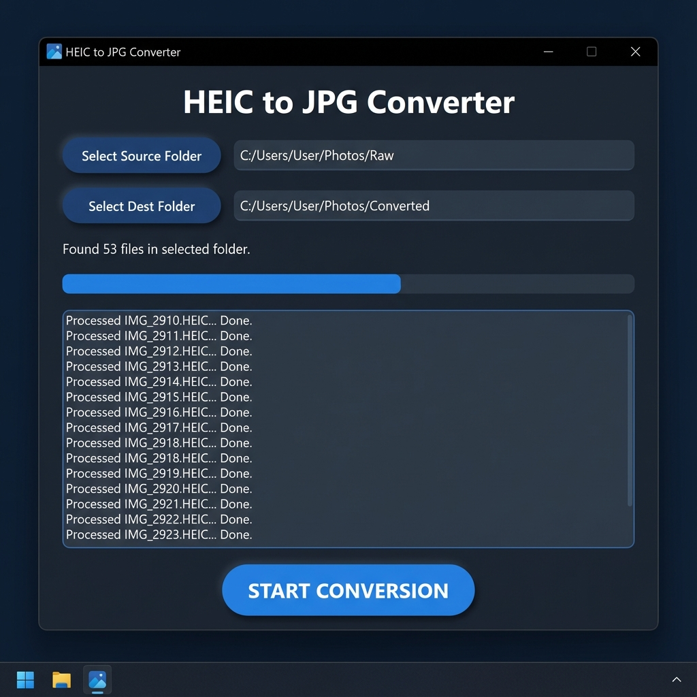

# 📸 Instagram vs. HEIC: The Android "Nope" Button

Ever tried to post that stunning iPhone shot on Instagram from your Android, only to find it… missing? Or worse, it just refuses to upload? You're not alone.

## 🛑 The Issue

> **Issue Description: Unable to Post .HEIC Images on Instagram Using Android**
>
> I faced an issue while trying to upload **.HEIC** (High Efficiency Image Container) image files on Instagram from an Android device. The images were visible on my phone and opened normally in the gallery, but when I selected them for uploading on Instagram, they either did not appear in the media picker or failed to upload.
>
> The root cause? **Format incompatibility.** Instagram on Android simply doesn't play nice with .HEIC files instantly, even though your phone displays them fine. It demands **JPEG** or **PNG**.
>
> *Result: No post, just frustration.*

---

## 🚀 How We Solved It

Instead of manually converting hundreds of photos one by one (because who has time for that?), we built a **high-speed Python automation tool**.

We created a script that:
1.  **Scans** a folder for all your memories (Photos & Videos).
2.  **Detects** those stubborn `.HEIC` files.
3.  **Converts** them to high-quality `.JPGs` (100% Quality, No Subsampling – keeping them crisp!).
4.  **Preserves** your videos (`.MP4`, `.MOV`) by copying them over safely.

Now, you have a folder ready to blast onto Instagram without a single glitch.

---

## 🔌 Plug-and-Play (No Coding Required)

Don't want to mess with Python? We've built a standalone app for you!

**Option A: The GUI App (Recommended)** 🖼️



1. Download `HeicToJpgConverter_GUI.exe`.
2. Double-click it.
3. Select your "Source Folder" (where the HEICs are).
4. Click **START CONVERSION**.
5. Watch the progress bar go!

**Option B: The One-Click Tool** ⚡
1.  Download `HeicToJpgConverter.exe`.
2.  double-click it.
3.  It auto-detects a `raw` folder or asks you for the path.
4.  **Watch it fly!** 🚀

---

## 🤓 Advanced Usage (CLI)
Power users can run the tool (script or exe) from the command line for more control:

```powershell
# Specify custom input and output folders
HeicToJpgConverter.exe --input "C:\My\Vacation Photos" --output "C:\My\Converted"
```

---

## 🛠️ How to Replicate This (For Developers)

Want to fix this yourself? Follow these simple steps.

### Prerequisites
- Python installed on your computer.
- A folder with all your mixed media (HEICs, JPEGs, MP4s, MOVs).

### 1. Set Up the Project
Open your terminal and create a new folder:
```bash
mkdir heic-converter
cd heic-converter
```

### 2. Create the Environment
It's best practice to use a virtual environment:
```bash
# Windows
python -m venv venv
.\venv\Scripts\activate

# Mac/Linux
python3 -m venv venv
source venv/bin/activate
```

### 3. Install the Magic Libraries
We use `Pillow` for image processing, `pillow-heif` for format support, plus `tqdm` and `colorama` for a beautiful CLI dashboard:
```bash
pip install Pillow pillow-heif tqdm colorama
```

### 4. The Script (`convert_photos.py`)
Create a file named `convert_photos.py` and paste the code from the repo. It handles:
- **Progress Bars**: Real-time tracking of 500+ files.
- **Smart Dashboard**: Summarizes converted vs. copied files.
- **Error Handling**: Skips bad files without crashing.

```python
import os
import shutil
from PIL import Image
from pillow_heif import register_heif_opener

# 1. Register HEIC opener so Pillow works with them
register_heif_opener()

SOURCE_DIR = 'raw'       # Put your original photos here
DEST_DIR = 'converted'   # Converted files go here

def convert_photos():
    if not os.path.exists(SOURCE_DIR):
        print(f"Make sure to create a '{SOURCE_DIR}' folder and put your photos in it!")
        return

    if not os.path.exists(DEST_DIR):
        os.makedirs(DEST_DIR)

    files = os.listdir(SOURCE_DIR)
    print(f"Found {len(files)} files processing...")

    for filename in files:
        file_path = os.path.join(SOURCE_DIR, filename)
        
        if os.path.isdir(file_path):
            continue

        name, ext = os.path.splitext(filename)
        ext_lower = ext.lower()

        # CONVERT HEIC IMAGES
        if ext_lower in ['.heic', '.heif']:
            print(f" Converting: {filename}")
            try:
                image = Image.open(file_path)
                image = image.convert('RGB')
                
                # Save as JPG with MAX Quality (No compression artifacts!)
                save_path = os.path.join(DEST_DIR, f"{name}.jpg")
                image.save(save_path, "JPEG", quality=100, subsampling=0)
            except Exception as e:
                print(f"Failed to convert {filename}: {e}")
        
        # JUST COPY EVERYTHING ELSE (Videos, JPGs)
        else:
            print(f" Copying: {filename}")
            try:
                shutil.copy2(file_path, os.path.join(DEST_DIR, filename))
            except Exception as e:
                print(f"Failed to copy {filename}: {e}")

    print("✅ All done! Check the 'converted' folder.")

if __name__ == "__main__":
    convert_photos()
```

### 5. Run It!
1. Creates a folder named `raw` inside your project folder.
2. Put all your Google Photos / Camera Roll files into `raw`.
3. Run the script:
```bash
python convert_photos.py
```

Boom! 💥 Check the `converted` folder. All your images are now Instagram-ready JPGs, and your videos are safely copied over.

---

## 💡 Important Notes
- **Quality Matters**: We deliberately set `quality=100` and `subsampling=0` in the script. This ensures you don't lose that crispness from your original shot.
- **Videos**: The script is smart enough not to try converting videos. It just copies them so you have everything in one place.
- **Google Photos Tip**: If downloading from Google Photos, you often get a mix of formats. This script handles that chaos perfectly.
